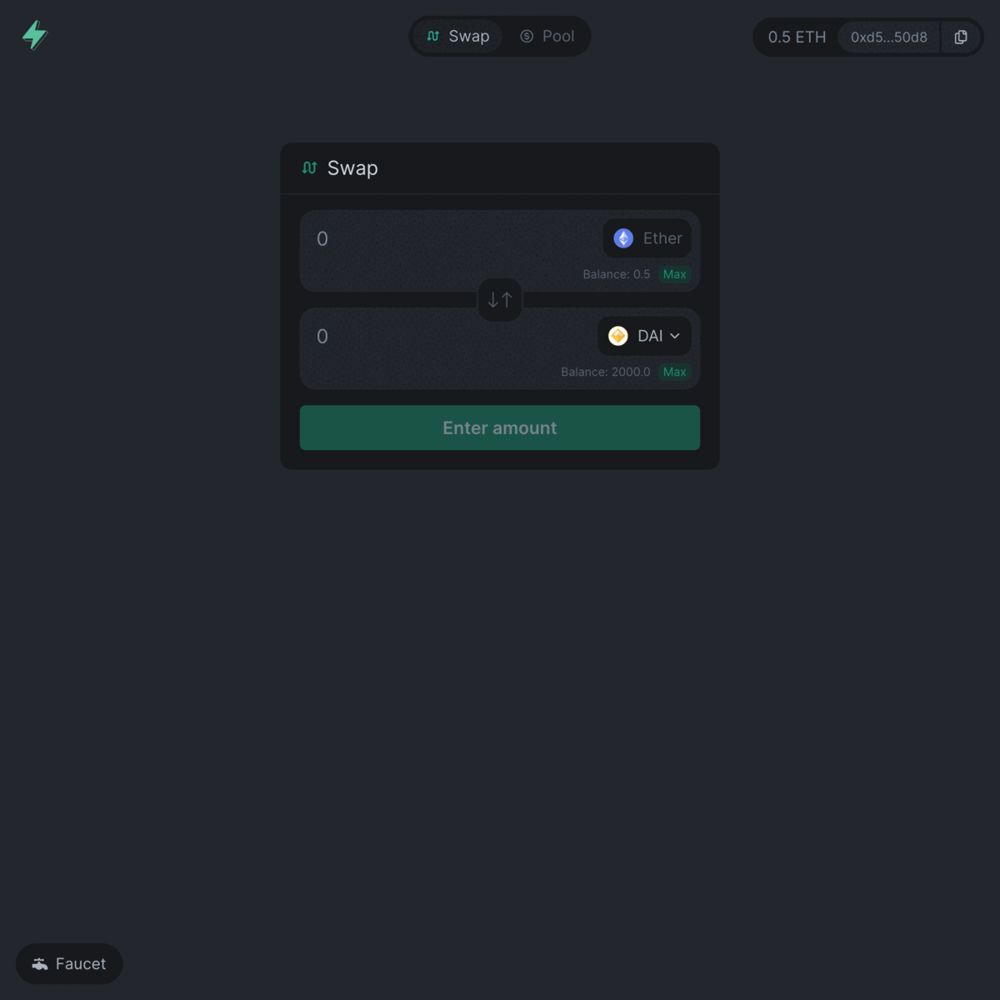

## 🌴💰 SwaySwap 💰🌴

Built with an entirely new language ([Sway](https://fuellabs.github.io/sway/latest/index.html)), virtual machine ([FuelVM](https://github.com/FuelLabs/fuel-specs)), and UTXO-based blockchain ([Fuel](https://fuel-labs.ghost.io/introducing-fuel-the-fastest-modular-execution-layer/)), you can now experience a demonstration of the next generation of scaling beyond layer-2s and monolithic design.

[Next version](https://swayswap.vercel.app/), see all current changes from the master branch. Note: this is the **WIP** changes and can be unstable.

## 📗 Table of contents

- [SwaySwap Features](#-swayswap-features)
- [Getting Started](docs/GETTING_STARTED.md)
  - [Requirements](docs/GETTING_STARTED.md#requirements)
  - [Running project locally](docs/GETTING_STARTED.md#running-project-locally)
    - [📚 - Getting the Repository](docs/GETTING_STARTED.md#---getting-the-repository)
    - [📦 - Install dependencies](docs/GETTING_STARTED.md#---install-dependencies)
    - [📒 - Run Local Node](docs/GETTING_STARTED.md#---run-local-node)
    - [💻 - Run Web App](docs/GETTING_STARTED.md#---run-web-app)
  - [📗 Project overview](docs/GETTING_STARTED.md#-project-overview)
  - [🧰 Useful scripts](docs/GETTING_STARTED.md#-useful-scripts)
  - [Running tests](docs/GETTING_STARTED.md#running-tests)
    - [Run tests on development mode](docs/GETTING_STARTED.md#running-tests-1)
    - [Run tests on a Local TEST Environment](docs/GETTING_STARTED.md#run-tests-on-a-local-test-environment)
- [Contribution Guide](docs/CONTRIBUTE_GUIDE.md)
  - [Finding Something to Work On](docs/CONTRIBUTE_GUIDE.md#finding-something-to-work-on)
  - [Contribution Flow](docs/CONTRIBUTE_GUIDE.md#contribution-flow)
- [License](#license)

## 🧰 SwaySwap Features

- Faucet coins; Use the faucet API to send ETH to your wallet
- Mint tokens; Use the Token Contract to mint DAI to your wallet
- Create a liquidity pool
- Swap tokens
- View current pool positions
- Remove liquidity

<!-- Add some more space on the top of the gif -->
 
 

  

## License

The primary license for this repo is `Apache-2.0`, see [`LICENSE`](./LICENSE).
