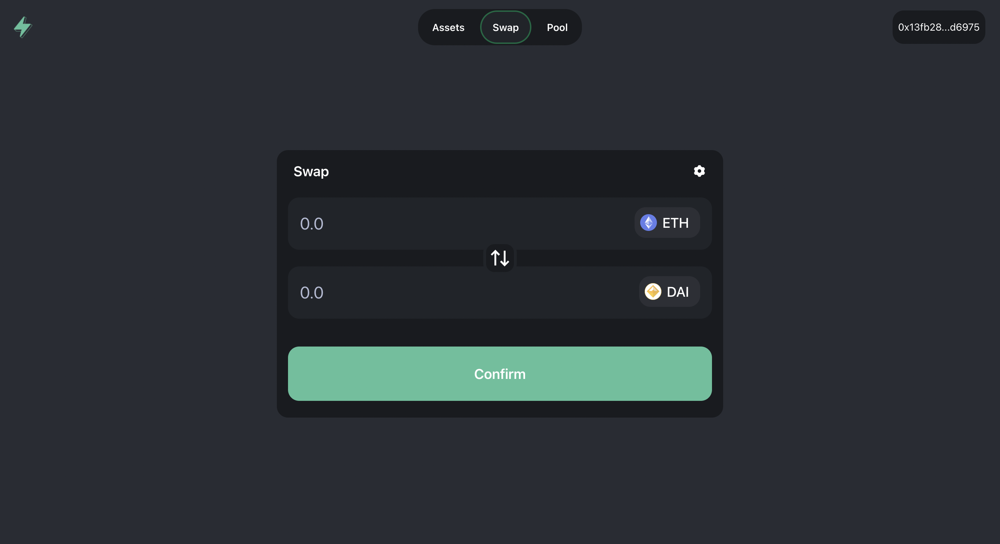

# ⚡️ SwaySwap

Short description

<!--  -->

## About the Project

About the project

## Getting Started

<!-- 1. [Set up your environment](#set-up-env-variables) -->

1. [Running the client](./packages/app/README.md)

<!--
### Set up ENV Variables
	TO-DO: Add infos about .env on the root README.md
	https://github.com/FuelLabs/swayswap/issues/62
-->

<!--
## Contributing

TODO: https://github.com/FuelLabs/swayswap/issues/54
-->

## License

The primary license for this repo is `Apache 2.0`, see [`LICENSE`](./LICENSE).
