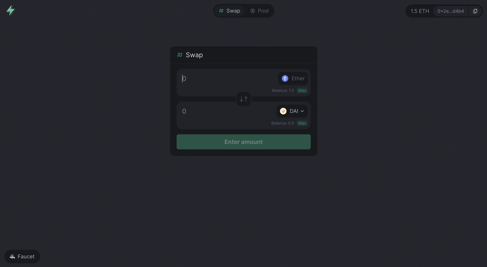

<h1 align="center">⚡️ SwaySwap</h1>

<p align="center">Short description</p>

<div align="center">
    
[](https://github.com/FuelLabs/swayswap)


    
</div>

## About the Project

About the project

## How to Install

1. [Set up your environment](#set-up-env-variables)
2. [Running the client](#running-the-client)

<br>

### Set up ENV Variables

### Running the Client

#### Go to the `client` folder

```sh
cd client
```

#### Install Dependencies

```sh
npm install
```


#### Start the Project

```sh
npm run start
```

#### Building the Client

```sh
npm run build
```

## Contributing

## License